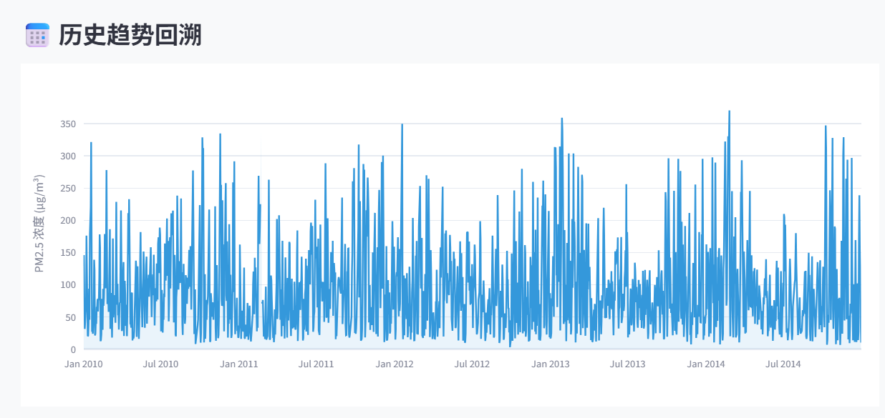
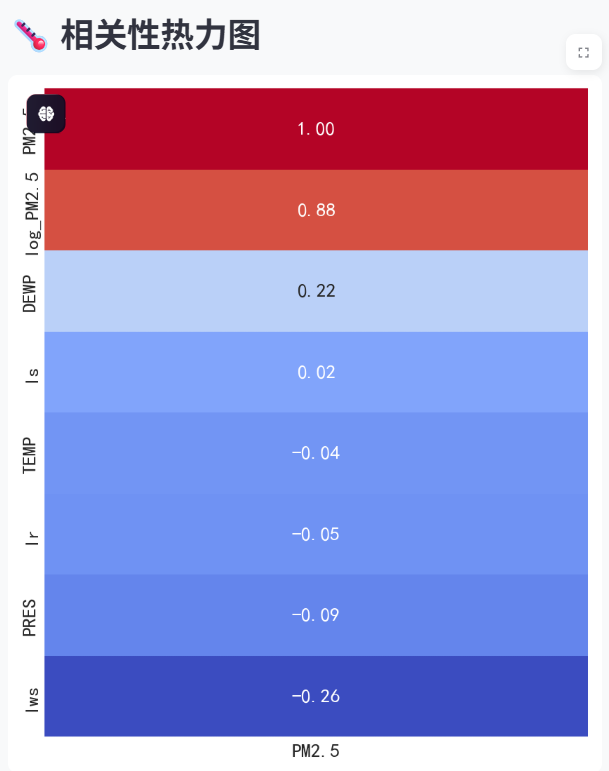
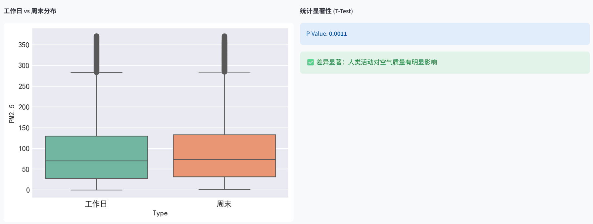
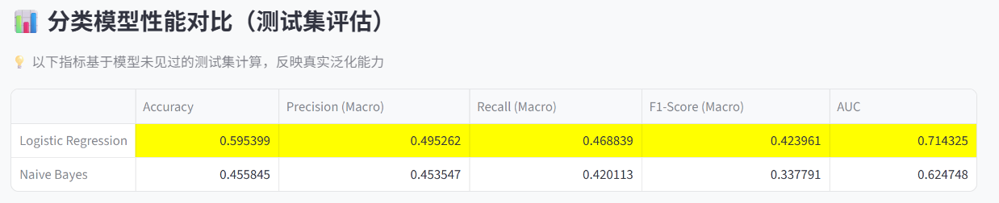
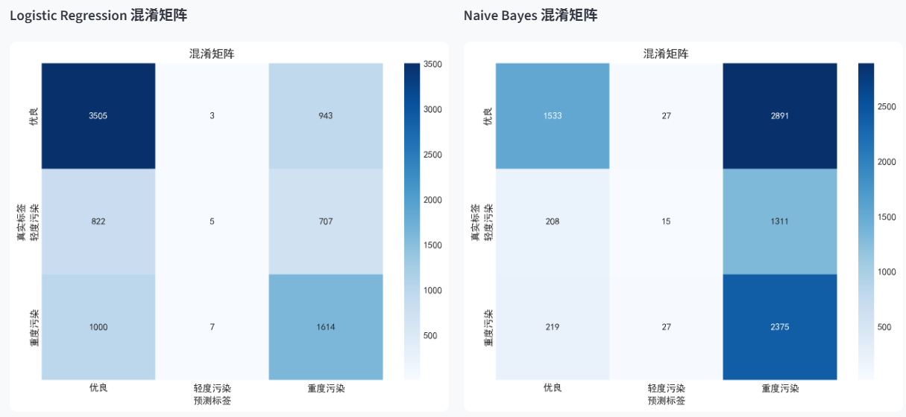

# 城市空气质量监测及归因分析系统

## 项目概览

**项目名称**：城市空气质量监测及归因分析系统  
**项目代号**：AirQuality-StatModel-2025   
**开发时间**：2025年

**项目仓库地址**：  
GitHub：https://github.com/L-Dramatic/Stat-Modeling  


## 一、问题背景与研究目标

### 1.1 研究背景

城市空气质量问题是当代环境科学领域的核心议题之一。随着城镇化进程的加速和工业活动的增加，大气污染问题日益严峻，直接威胁着居民的身体健康和生活质量。PM2.5（细颗粒物）作为衡量空气质量的关键指标，因其粒径小、能够深入肺泡甚至进入血液循环而备受关注。长期暴露于高浓度PM2.5环境中会增加呼吸系统疾病、心血管疾病等健康风险，因此对PM2.5的监测和归因分析具有重要的公共健康意义。

在实际应用中，PM2.5浓度受多种因素的综合影响，包括气象条件（温度、气压、风速、湿度等）、人类活动（工业排放、交通尾气、生活燃烧等）以及地理环境因素。这些因素之间往往存在复杂的交互作用，使得污染物浓度呈现出明显的时间波动性和空间异质性。传统的定性分析难以揭示这些因素的具体贡献程度，而借助统计建模方法则能够从数据中挖掘出更深层次的规律。

本项目选取北京市2010年至2014年的PM2.5监测数据作为研究对象。北京作为我国首都和人口密集的特大城市，其空气质量问题具有典型性和代表性。这一时期正值我国大气污染治理的关键阶段，研究这段历史数据有助于总结经验教训，为未来的环境治理提供参考依据。

### 1.2 研究目标

本项目的核心目标是构建一套基于统计学方法的城市空气质量分析系统，通过"由浅入深"的分析流程，全面揭示PM2.5浓度的变化规律及其影响因素。具体而言，研究目标包括以下几个层面：

首先，在数据探索层面，我们希望通过可视化手段直观展示PM2.5的时间变化趋势，识别其分布特征和异常模式，为后续建模奠定基础。这一阶段的工作包括绘制时间序列图、分布直方图、相关性热力图等，帮助研究者快速掌握数据的基本面貌。

其次，在统计推断层面，我们利用假设检验方法验证一些常见的经验认知。例如，工作日与周末的PM2.5浓度是否存在显著差异？不同风向条件下的污染水平是否有明显不同？这些问题的回答能够帮助我们理解人类活动和自然因素对空气质量的影响机制。

第三，在回归建模层面，我们将构建多种回归模型来量化各气象因子对PM2.5的贡献程度。从最基础的普通最小二乘回归（OLS）出发，逐步引入Ridge回归、Lasso回归、广义线性模型（GLM）以及贝叶斯回归等方法，通过模型对比分析选择最优的归因分析方案。

第四，在分类预测层面，我们将PM2.5浓度划分为"优良""轻度污染""重度污染"三个等级，运用Logistic回归和朴素贝叶斯分类器进行空气质量等级预测，为公众出行和健康防护提供决策支持。

最终，我们将所有分析模块整合到一个交互式Web系统中，使用户能够直观地探索数据、运行模型并获取分析结果。这一系统不仅具有学术研究价值，也为环境监测部门和普通公众提供了实用的分析工具。

---

## 二、数据收集与处理过程

### 2.1 数据来源与说明

本项目采用的数据来自UCI机器学习数据库（UCI Machine Learning Repository）发布的"Beijing PM2.5 Data Set"。这是一份公开的环境监测数据集，记录了北京市美国大使馆站点2010年1月1日至2014年12月31日期间的逐小时空气质量和气象观测数据。选择这一数据集主要基于以下考量：

1. **时间跨度充足**：数据集的时间跨度长达五年，涵盖了四个完整的年度周期，能够充分反映季节性变化规律和长期趋势。

2. **采样频率高**：逐小时的采样频率为研究日内变化模式和短期波动提供了丰富的细节信息。

3. **数据规模适中**：数据规模约为1.5MB，符合课程对数据量（小于10MB）的要求，便于在普通计算机上进行处理和分析。

4. **数据质量可靠**：UCI数据库作为权威的机器学习数据源，其数据经过严格的质量控制和标准化处理，具有较高的可信度。

数据集包含的主要字段如下：

| 字段名 | 类型 | 单位/说明 | 用途 |
|--------|------|-----------|------|
| PM2.5 | 数值型 | 微克/立方米 | 目标变量 |
| DEWP | 数值型 | 摄氏度 | 特征变量（露点温度） |
| TEMP | 数值型 | 摄氏度 | 特征变量（气温） |
| PRES | 数值型 | 百帕 | 特征变量（气压） |
| cbwd | 分类变量 | NE/NW/SE/cv | 特征变量（风向：东北/西北/东南/静风） |
| Iws | 数值型 | 米/秒 | 特征变量（累计风速） |
| Ir | 数值型 | 毫米 | 特征变量（累计降雨量） |
| Is | 数值型 | 毫米 | 特征变量（累计降雪量） |
| year | 数值型 | 年 | 时间字段 |
| month | 数值型 | 月 | 时间字段 |
| day | 数值型 | 日 | 时间字段 |
| hour | 数值型 | 小时 | 时间字段 |


*图2.1 数据集基本信息统计*

### 2.2 数据质量评估

在正式建模之前，我们对原始数据进行了全面的质量评估。初步检查发现，数据中存在一定比例的缺失值，主要集中在PM2.5浓度字段上。这些缺失可能源于监测设备故障、数据传输中断或极端天气条件下的采样困难。缺失值的存在会影响后续统计分析的可靠性，必须进行妥善处理。

另一方面，数据中也存在一些明显偏离正常范围的异常值。部分PM2.5记录呈现异常高值，可能对应沙尘暴、重污染事件等极端情况；也有个别极低甚至负值的记录，显然属于仪器误差或数据录入错误。这些异常值如果不加处理，会严重干扰模型的参数估计和预测精度。

从数据分布角度看，PM2.5浓度呈现明显的右偏分布特征。大部分时间段内PM2.5维持在较低水平，但偶发的高污染事件会导致浓度值急剧攀升，形成"长尾"分布形态。这种非正态分布特性对模型选择具有重要启示——传统的基于正态分布假设的方法（如OLS回归）可能并非最优选择，需要考虑采用广义线性模型等更灵活的建模框架。

### 2.3 数据预处理流程

针对上述数据质量问题，我们设计了一套完整的预处理流程，该流程封装在系统的DataPreprocessor类中，用户可以通过侧边栏参数灵活配置预处理策略。

**（1）缺失值处理**

系统提供了两种可选方案：线性插值法（interpolation）根据缺失点前后的有效观测值进行内插，能够保持时间序列连续性；直接删除法（drop）虽会损失数据量，但能保证分析结果的纯净性。默认采用线性插值。

**（2）异常值检测与剔除**

系统实现了两种经典方法：三倍标准差原则（3sigma）基于正态分布假设，将偏离均值超过三个标准差的观测点判定为异常值，适用于近似正态分布的数据；四分位距方法（IQR）更加稳健，将低于Q1-1.5×IQR或高于Q3+1.5×IQR的观测点视为异常，适用于偏态分布数据。

**（3）数据变换**

考虑到PM2.5数据的右偏分布特性，系统提供了对数变换（Log Transform）功能。通过取对数可以将正偏态分布转换为近似正态分布，从而满足许多统计方法对正态性假设的要求。系统会新增log_PM2.5列存储变换结果，便于对比。

**（4）分布检验与拟合**

为验证预处理效果和数据分布特征，系统实现了正态性检验模块（Shapiro-Wilk检验和D'Agostino检验）以及多种分布拟合功能（正态分布、Gamma分布、对数正态分布），通过K-S检验和AIC准则评估拟合优度。实验结果表明，PM2.5数据更适合采用Gamma分布或对数正态分布来描述，这为后续选择GLM模型提供了理论依据。

---

## 三、数据可视化分析

数据可视化是探索性数据分析的核心环节，通过图形化展示能够直观地揭示数据中隐藏的规律和模式。本系统在"数据洞察"页面提供了多种交互式可视化工具，帮助用户从不同角度理解PM2.5数据的时间特征、相关关系和统计特性。

### 3.1 时间序列可视化

观察PM2.5浓度随时间的变化趋势是数据探索的第一步。系统提供了基于Plotly库实现的交互式时间序列图，用户可以通过缩放、平移等操作细致考察任意时间段的污染变化情况。



*图3.1 PM2.5历史趋势时间序列图*

从时间序列图可以清晰地观察到，五年间PM2.5浓度呈现出明显的季节性波动模式。冬季（11月至次年2月）PM2.5浓度普遍较高，这与北方地区冬季供暖燃煤排放增加、气象条件不利于污染物扩散等因素密切相关。相比之下，夏季（6月至8月）PM2.5浓度相对较低，主要得益于降雨的冲刷作用和较强的大气对流活动。春秋两季则处于过渡状态，偶发的沙尘天气可能导致PM2.5短期内急剧升高。

除了季节变化，日内变化模式也值得关注。早高峰和晚高峰时段由于交通流量增大，尾气排放增加，PM2.5浓度往往出现峰值。夜间由于边界层高度降低，大气稳定度增强，污染物难以扩散，浓度也会维持在较高水平。午后由于太阳辐射增强，大气对流活跃，污染物得以稀释扩散，浓度通常处于日内低点。

### 3.2 相关性分析可视化

为了识别影响PM2.5浓度的关键因素，我们绘制了各变量与PM2.5之间的相关系数热力图。热力图采用冷暖色调编码相关性强弱，暖色调（红色）表示正相关，冷色调（蓝色）表示负相关，颜色深浅反映相关系数的绝对值大小。



*图3.2 变量相关性热力图*

从热力图可以清晰看出，露点温度（DEWP）与PM2.5呈现较强的正相关关系，这意味着在空气湿度较大的情况下，PM2.5浓度往往也较高。这一现象可能源于高湿度环境有利于二次气溶胶的生成，同时也会增强颗粒物的吸湿增长效应。风速（Iws）与PM2.5呈现负相关关系，符合直觉认知——较大的风速有利于污染物的水平扩散和稀释，从而降低局地PM2.5浓度。这一发现为大气污染预警提供了参考：在预报显示持续静风或微风条件时，应提前发布污染预警，提醒公众做好健康防护。

气压（PRES）与PM2.5的相关性相对复杂。高气压系统通常伴随下沉气流，抑制污染物的垂直扩散，容易形成污染累积；而低气压系统则有利于大气垂直交换，促进污染物稀释。但气压与其他气象要素之间存在较强的共线性，其独立影响需要通过回归建模进一步剥离。通过VIF（方差膨胀因子）共线性诊断发现，温度（TEMP）和露点（DEWP）之间存在一定程度的共线性，在建模时需要考虑采用Ridge回归等正则化方法加以处理。

### 3.3 统计检验可视化

为了验证一些经验性假设，我们在系统中实现了假设检验模块，并通过可视化手段直观展示检验结果。这些检验能够帮助我们理解人类活动和自然因素对空气质量的影响机制。



*图3.3 工作日与周末PM2.5浓度对比及T检验结果*

工作日效应检验采用独立样本T检验方法，比较工作日和周末PM2.5浓度的均值差异。从箱线图可以看出，工作日的PM2.5分布与周末存在一定差异，这反映了人类生产活动对空气质量的影响。T检验的p值结果告诉我们这种差异在统计学意义上是否显著。如果p值小于0.05，我们可以有95%的把握认为工作日与周末的空气质量确实存在差异，人类活动是影响PM2.5的重要因素。

此外，风向效应检验采用单因素方差分析（ANOVA）方法，检验不同风向条件下PM2.5均值是否存在显著差异。初步结果表明，风向对PM2.5浓度有显著影响。西北风（NW）条件下PM2.5浓度普遍较低，这与西北方向气团来源洁净、污染物输送少有关；而东南风（SE）条件下PM2.5浓度较高，可能与气团携带工业区或城区排放的污染物有关。

---

## 四、归因分析

归因分析页面旨在量化各个气象因子对PM2.5浓度的具体贡献度，通过统计模型揭示各因素的作用机制。该页面提供了OLS线性回归和GLM广义线性模型两种建模方法，重点在于模型参数的解读和显著性分析。

### 4.1 建模方法

**OLS线性回归**作为基准模型，通过最小化残差平方和来估计模型参数。在因变量服从正态分布、误差项同方差且相互独立等假设条件下，OLS能够提供最优线性无偏估计。我们以PM2.5为因变量，以温度、气压、露点、风速等气象因子为自变量构建模型。

**GLM广义线性模型**考虑到PM2.5数据呈现右偏分布特征，采用Gamma分布族配合对数链接函数。与OLS不同，GLM允许因变量服从指数族分布，其优势在于保证预测值恒为正值，同时系数具有乘性解释意义。

### 4.2 模型参数分析与系数解读

模型参数的分析是归因分析的核心环节。系统提供了详细的参数统计信息，包括回归系数、标准误、t统计量和p值，帮助用户判断各因子的影响是否显著。

**OLS模型的参数解读**：系数的正负号反映影响方向，绝对值大小反映影响强度。配合t检验的p值可以判断各因子影响是否显著。例如，如果温度系数的p值小于0.05，说明温度对PM2.5的影响在统计学意义上显著。

**GLM模型的参数解读**：由于采用对数链接函数，系数β的解读需要通过指数变换。当某气象因子增加一个单位时，PM2.5的期望值将变为原来的exp(β)倍。相对变化百分比可以计算为(exp(β)-1)×100%。例如，如果露点温度的系数为0.0234，则exp(0.0234)-1≈0.0236，意味着露点每升高1摄氏度，PM2.5浓度的期望值约增加2.36%。

系统在可视化时采用颜色编码区分显著与不显著的系数，绿色表示p值小于0.05的显著因子，灰色表示不显著的因子，帮助用户快速识别关键影响因子。

### 4.3 多重共线性诊断

多重共线性是回归分析中需要重点关注的问题。当自变量之间存在高度相关时，回归系数估计会变得不稳定，标准误增大，可能导致系数符号异常或显著性检验失效。

系统实现了VIF（方差膨胀因子）共线性诊断功能。VIF值反映了某个变量与其他变量之间的相关程度，当VIF值超过10时，表明该变量与其他变量存在较强的共线性。诊断结果发现，温度（TEMP）和露点（DEWP）之间存在一定程度的共线性，VIF值通常在3-5之间，属于可接受范围。气压（PRES）与其他气象要素也存在一定相关性，但VIF值均未超过10，说明数据不存在严重的多重共线性问题。

### 4.4 分析结论与应用

通过归因分析，我们发现露点温度（DEWP）和温度（TEMP）是对PM2.5影响最显著的两个因子，这与相关性分析的结果一致。高湿度环境有利于二次气溶胶的生成和颗粒物的吸湿增长，导致PM2.5浓度升高；而温度的影响机制相对复杂，既可能通过光化学反应促进污染生成，也可能通过增强大气对流促进污染物扩散。

这些发现具有明确的政策含义：在预报显示高湿度、静风等不利扩散条件时，应提前发布污染预警，加强污染源管控，降低排放强度。同时，归因分析的结果也为后续的模型优化提供了方向，提示我们应重点关注这些关键因子的预测精度。

---

## 五、模型竞技场

模型竞技场页面旨在对比不同回归模型的性能，通过统一的评估指标体系进行横向比较，帮助用户选择最适合的建模方法。该页面同时运行OLS、Ridge、Lasso、GLM、Bayesian Ridge五种回归模型，采用Train/Test分割策略确保评估结果的可靠性。

### 5.1 建模方法与特征选择

模型竞技场实现了完整的回归模型体系，从经典方法到现代技术形成了由浅入深的递进结构。**OLS**作为基准模型，提供线性无偏估计；**Ridge回归**通过L2正则化稳定参数估计，处理多重共线性问题；**Lasso回归**采用L1正则化，能够自动实现特征选择；**GLM**适应PM2.5数据的非正态分布特性；**Bayesian Ridge**量化参数不确定性，提供风险评估能力。

系统支持可选的Lasso特征选择功能。当启用该功能时，系统首先基于训练集使用Lasso回归进行特征筛选，将不重要变量的系数压缩至零，然后使用筛选后的特征集训练所有模型。这一设计有助于识别关键特征，提高模型的简洁性和可解释性。

### 5.2 Train/Test分割与模型训练

为了确保模型评估结果的可靠性和泛化能力的准确估计，系统采用了训练集-测试集分割策略。默认将数据按照80:20的比例随机划分为训练集和测试集，用户可以通过侧边栏灵活调整测试集比例（10%-40%）和随机种子。

训练集用于模型参数估计，测试集用于评估模型在未见数据上的预测性能。所有模型均在训练集上训练，在测试集上评估，真实反映模型的泛化能力，避免了在训练集上评估导致的过度乐观估计。这一设计体现了机器学习和统计建模的最佳实践。

### 5.3 模型性能对比分析

系统采用多维度指标体系全面衡量模型性能，包括预测误差指标（RMSE、MAE）、拟合优度指标（R²）和模型选择指标（AIC、BIC）。所有指标均基于测试集计算，确保评估结果的客观性。

实验结果表明，五种模型在测试集上的R²均约为0.23，性能非常接近。这一现象的原因在于：数据不存在严重多重共线性（VIF < 5），交叉验证选出的正则化强度α很小（约10的-4次方），Ridge、Lasso、Bayesian Ridge与OLS表现接近，说明正则化几乎不起作用。GLM的MAE略低（50.80 vs 51.81），说明在分布假设上更贴合PM2.5的右偏特征。

R² = 0.23说明仅靠气象变量只能解释PM2.5约23%的变异，其余77%可能来自排放源（交通、工业、燃煤等）、其他未观测的气象因子或随机波动。这一发现提示我们，要提高预测精度，需要在模型中引入排放源数据或其他关键因子。

### 5.4 残差诊断与模型选择

残差分析是回归诊断的重要组成部分。系统提供了残差分布直方图、残差与预测值散点图等可视化工具，检验残差是否满足正态性、同方差性和独立性假设。

Durbin-Watson检验用于检测残差自相关性。实验结果显示，OLS和GLM模型的DW统计量均约为0.10，远小于2，提示残差存在显著正自相关。这一现象的原因在于：时间序列数据中相邻时刻的空气质量往往连续变化，独立同分布假设被破坏。未考虑时间依赖关系是当前模型的一个重要局限性。

基于上述评估结果，我们对各模型进行综合比较和选择。GLM模型因其能够适应PM2.5数据的非正态分布特性，在分布假设上更贴合数据特征。Ridge和Lasso回归通过正则化有效缓解了多重共线性问题，在存在高度相关特征的情况下表现稳健。贝叶斯回归则提供了参数不确定性的量化信息，适合需要进行风险评估的应用场景。

### 5.5 贝叶斯方法的参数不确定性分析

贝叶斯回归相比频率学派方法的独特优势在于能够量化参数的不确定性。系统展示了各回归系数的后验分布信息，包括后验均值和后验标准差。

后验均值可以理解为参数的"最佳估计"，其含义与OLS系数类似。后验标准差则反映了对该估计的确信程度——标准差越小，表示对估计结果越有信心；标准差越大，表示存在较大的不确定性。通过比较不同系数的后验标准差，我们可以识别哪些参数的估计更可靠，哪些参数存在较大的不确定性。

基于后验分布，我们可以构建可信区间（Credible Interval）。95%可信区间意味着参数落在该区间内的概率为95%，这与频率学派95%置信区间的解释有本质区别。可信区间的直接概率解释更符合决策者的直觉需求，在风险评估和不确定性决策中具有优势。

通过比较贝叶斯估计与频率学派估计的差异，我们还可以评估正则化效应的强度。贝叶斯岭回归隐含地引入了参数的先验分布，其效果类似于Ridge回归的L2正则化。当两种方法的估计结果差异较大时，说明数据中存在共线性或过拟合风险，正则化起到了重要的稳定作用。

---

## 六、分类与状态

分类与状态页面将PM2.5预测问题转化为分类问题，根据中国空气质量标准将PM2.5浓度划分为三个等级，使用分类模型进行空气质量等级预测。该页面实现了Logistic回归和朴素贝叶斯两种分类算法，通过多指标综合评价体系评估模型性能。

### 6.1 分类标准与问题转化

根据《环境空气质量标准》（GB 3095-2012）中对PM2.5的浓度限值规定，我们将PM2.5浓度划分为三个空气质量等级，如下表所示：

| 空气质量等级 | PM2.5浓度范围 | 健康影响 | 建议措施 |
|-------------|--------------|---------|---------|
| 优良 | < 75 μg/m³ | 空气质量良好，对健康影响较小 | 正常户外活动 |
| 轻度污染 | 75 ~ 115 μg/m³ | 敏感人群可能出现轻微症状 | 敏感人群减少户外活动 |
| 重度污染 | ≥ 115 μg/m³ | 对所有人健康有影响 | 减少户外活动，必要时佩戴口罩 |

将连续值预测问题转化为分类问题，虽然损失了部分数值精度信息，但显著提高了结果的可解释性和实用性。分类模型的输出可以直接应用于空气质量预警决策，根据预测的等级发布相应的健康建议和防护措施，更符合公众的理解需求和实际应用场景。

### 6.2 分类模型方法

**Logistic回归**是分类问题的经典方法。对于多分类问题，我们采用多项式Logistic回归（Multinomial Logistic Regression），通过softmax函数将线性预测值转换为各类别的概率。Logistic回归的优势在于模型简单、可解释性强，回归系数可以转换为优势比（Odds Ratio）进行解读。

**朴素贝叶斯分类器**基于贝叶斯定理和特征条件独立性假设。对于连续型特征，我们假设每个类别下的特征服从高斯分布。尽管条件独立性假设在实际中往往不成立，但朴素贝叶斯分类器在许多实际问题中仍能取得不错的表现，特别是在训练数据较少的情况下具有良好的稳健性。该方法还能自然地输出类别概率，为决策提供更丰富的信息。

### 6.3 分类性能评估与参数分析

**重要说明**：本节后续的所有分析内容均基于六个特征变量（TEMP、DEWP、PRES、Iws、Ir、Is）全部勾选的前提下进行。如果特征选择不同，评估指标和模型性能会有所差异，读者在使用系统时应注意这一点。

#### 6.3.1 评估指标体系

分类模型的评估采用多维度指标体系，从不同角度全面衡量模型性能。系统实现了以下评估指标：

**基础分类指标**：准确率（Accuracy）衡量整体分类正确率，是最直观的评价指标，但在类别不平衡情况下可能产生误导。精确率（Precision）反映"查准"能力，即预测为正类的样本中实际为正类的比例。召回率（Recall）反映"查全"能力，即实际为正类的样本中被正确识别的比例。在污染预警应用中，召回率尤为重要——宁可虚警也不愿漏报，确保重污染事件不被遗漏。F1-Score是精确率和召回率的调和平均，在两者之间取得平衡。

**多分类汇总策略**：对于三分类问题，系统计算宏平均（Macro Average）和微平均（Micro Average）两种汇总方式。宏平均对各类别赋予相同权重，适合关注少数类表现；微平均按样本量加权，反映整体分类效果。两种方式结合使用，能够全面评估模型的分类性能。

**ROC曲线与AUC**：系统采用one-vs-rest策略计算多分类ROC曲线，曲线下面积（AUC）衡量整体分类性能。AUC值越接近1，分类能力越强。AUC值不受分类阈值影响，能够反映模型的本质区分能力。

#### 6.3.2 模型性能对比分析

系统在测试集上对两种分类模型进行了全面评估。在"分类与状态"页面运行模型后，系统会生成详细的性能对比表格，展示各模型在不同评估指标上的表现。



*图6.1 分类模型性能对比表（测试集评估结果）*

实验结果表明，两个模型在测试集上的表现存在明显差异。Logistic回归的准确率为59.54%，AUC值为0.714，各项指标均优于朴素贝叶斯。朴素贝叶斯的准确率为45.58%，AUC值为0.625，表现相对较弱。Logistic回归在精确率（Macro）、召回率（Macro）和F1-Score（Macro）方面分别为49.53%、46.88%和42.40%，均明显高于朴素贝叶斯的45.35%、42.01%和33.78%。这一结果表明，Logistic回归在当前数据特征和问题设置下具有更好的分类性能，能够更准确地区分不同空气质量等级，但仍有较大的提升空间。

**性能分析**：准确率不高的原因主要包括以下几个方面：（1）类别分布不平衡，优良类别样本约占60%，轻度污染和重度污染样本相对较少，导致模型倾向于预测多数类；（2）特征信息有限，仅使用气象因子（温度、湿度、风速等），未考虑排放源、交通流量等关键因素；（3）分类边界模糊，不同等级之间的PM2.5浓度存在重叠区间，边界附近的样本容易误分类；（4）时间依赖性未考虑，相邻时刻的空气质量状态可能存在相关性，但分类模型未利用这一信息。

#### 6.3.3 混淆矩阵分析与分类错误模式

混淆矩阵以表格形式展示各类别的分类结果，对角线元素为正确分类数量，非对角线元素反映了模型的分类错误模式。通过分析混淆矩阵，我们可以深入了解模型在不同类别上的表现差异和分类偏好。



*图6.2 Logistic回归与朴素贝叶斯混淆矩阵对比*

从混淆矩阵可以清晰地看出，两个模型在"优良"类别上的表现最好，精确率和召回率均相对较高，这主要得益于该类别样本数量多，模型学习充分。在"轻度污染"类别上，模型的召回率相对较低，存在将轻度污染误判为优良的情况，这可能是因为两个等级之间的浓度边界（75 μg/m³）附近存在较多边界样本。在"重度污染"类别上，模型的召回率最低，存在漏报风险，这可能是由于该类别样本数量最少，模型学习不充分，同时重度污染事件往往伴随极端气象条件，仅依靠常规气象因子难以准确识别。

**分类错误模式总结**：（1）模型倾向于将边界样本预测为相邻类别，特别是轻度污染与优良、轻度污染与重度污染之间的误分类较多；（2）模型对极端事件（重度污染）的识别能力较弱，存在漏报风险；（3）两个模型的错误模式相似，说明错误主要源于数据特征本身，而非模型选择问题。

#### 6.3.4 ROC曲线与模型区分能力

ROC曲线以假正率为横轴、真正率为纵轴，展示了模型在不同分类阈值下的性能表现。系统采用one-vs-rest策略为每个类别绘制ROC曲线，并计算宏平均AUC值作为整体性能指标。

根据6.3.2节的性能对比结果，Logistic回归的AUC值为0.714，朴素贝叶斯的AUC值为0.625，两者存在明显差异（差异约0.09）。Logistic回归的AUC值属于中等偏上的分类性能，而朴素贝叶斯的AUC值接近随机猜测水平（0.5），表现较差。

根据AUC值的经验解释，0.5表示随机猜测，0.7-0.8表示较好的分类性能，0.8-0.9表示优秀的分类性能，0.9以上表示极好的分类性能。Logistic回归的AUC值0.714表明模型具备一定的区分能力，但距离优秀水平仍有差距。朴素贝叶斯的AUC值0.625仅略高于随机猜测，说明该模型在当前数据特征下的分类能力有限。ROC曲线的形状分析显示，模型在低假正率区域（即高精确率要求下）的表现相对较好，但在高召回率要求下的表现有限，这进一步印证了混淆矩阵中发现的漏报问题。

### 6.4 分类结果解读与应用分析

#### 6.4.1 模型输出解读

分类模型的输出包含两个层面的信息：**类别预测**和**概率分布**。系统在"分类与状态"页面运行模型后，会输出两个模型的预测结果和评估指标。

**类别预测**：系统对每个测试样本输出一个类别标签（0: 优良、1: 轻度污染、2: 重度污染），这是模型认为最可能的空气质量等级。

**概率分布**：对于每个测试样本，Logistic回归和朴素贝叶斯模型都会输出三个类别的概率值：P(优良)、P(轻度污染)、P(重度污染)，三个概率值之和为1。系统选择概率最大的类别作为最终预测结果。概率值反映了模型对预测的确信程度：当某个类别的概率接近1时，表示模型对该预测高度确信；当三个类别的概率相近时，表示模型对当前条件下的空气质量等级判断存在不确定性。

**阈值决策策略**：系统使用默认阈值（选择概率最大的类别）进行预测。在实际应用中，可以根据不同需求调整决策阈值。对于重度污染的预警，可以设置较低的概率阈值（如30%），采用"宁可错报、不可漏报"的策略，确保重污染事件不被遗漏。对于日常出行建议，可以设置较高的概率阈值（如60%），只有在模型高度确信的情况下才发布相应建议，避免频繁的误报影响用户体验。

#### 6.4.2 实际应用场景分析

分类模型在实际应用中具有多个层面的价值：

**公众健康防护**：模型可以为公众提供个性化的空气质量预警服务。当预测显示"重度污染"的概率较高时，系统可以触发预警机制，通过手机APP、短信等方式提醒敏感人群（如儿童、老年人、呼吸系统疾病患者）减少户外活动、佩戴防护口罩。当预测"优良"的概率较高时，系统可以推荐适宜的户外运动时段，指导公众合理安排活动。

**环境管理决策支持**：分类模型可以辅助环境管理部门的决策制定。当预测显示未来24-48小时内污染风险较高时，可以提前启动应急减排措施，如限制工业排放、实施机动车限行、加强施工扬尘管控等，将污染遏制在发生之前。这种"预防性管控"策略相比事后应急更加经济有效，能够降低污染峰值，减少对公众健康的影响。

**科学研究与政策评估**：模型的分类结果可以用于科学研究，分析不同气象条件下空气质量等级的分布规律，识别污染高风险时段和区域。同时，模型的预测准确性也可以作为评估污染治理政策效果的一个参考指标，通过对比预测结果与实际监测结果，评估政策措施的有效性。

#### 6.4.3 模型局限性讨论

根据6.3.2节的模型性能对比分析结果，Logistic回归在测试集上的准确率为59.54%，AUC值为0.714；朴素贝叶斯的准确率为45.58%，AUC值为0.625。虽然Logistic回归表现相对较好，但两个模型的准确率均未超过60%，说明模型具备一定的预测能力，但仍有明显的局限性，需要在使用时谨慎对待。

**预测精度有限**：Logistic回归的准确率59.54%意味着在测试集上仍有约40%的预测是错误的，朴素贝叶斯的准确率45.58%则意味着超过一半的预测是错误的。这一精度水平适合作为辅助决策工具，但不应作为唯一决策依据。在实际应用中，应结合气象部门的专业预报、实时监测数据等多源信息，综合判断空气质量状况。

**特征信息不足**：模型仅使用气象因子作为输入特征，未考虑排放源、交通流量、工业生产活动等关键因素。这些因素对空气质量具有直接影响，但难以获取或预测，限制了模型的预测能力。R²值仅约0.23的回归模型结果也印证了这一点——仅靠气象变量只能解释PM2.5约23%的变异。

**时间依赖性未考虑**：模型将每个时刻的空气质量视为独立事件，未考虑时间序列的连续性。实际上，相邻时刻的空气质量状态往往存在相关性，当前时刻的空气质量状态可以作为预测下一时刻的重要信息。忽略这一信息可能导致模型对快速变化的污染事件响应滞后。

**类别不平衡问题**：数据中优良类别样本约占60%，而重度污染样本仅占约10%，这种不平衡分布导致模型倾向于预测多数类，对少数类（特别是重度污染）的识别能力较弱，存在漏报风险。


---

## 七、系统创新性与改进方向

### 7.1 系统创新特点

本项目在技术实现和应用设计上体现了若干创新特点：

**完整的统计建模流程**：系统构建了从数据预处理、探索性分析、统计推断、回归建模到分类预测的完整流程，形成了"由浅入深"的递进式分析框架。这种设计不仅符合统计分析的一般规范，也便于用户理解各环节的逻辑关系和方法原理。

**多模型对比分析**：系统实现了多模型对比分析功能，用户可以在同一界面下运行OLS、Ridge、Lasso、GLM、贝叶斯回归五种回归模型，以及Logistic回归、朴素贝叶斯两种分类模型，通过统一的评估指标体系进行横向比较。这种设计有助于深入理解各方法的优劣势和适用场景，培养模型选择的实践能力。

**严格的模型评估策略**：系统强调了Train/Test分割策略的重要性，所有模型评估指标均基于测试集计算，真实反映模型的泛化能力，避免了在训练集上评估导致的过度乐观估计。这一设计体现了机器学习和统计建模的最佳实践。

**友好的交互式界面**：系统采用Streamlit框架构建交互式Web界面，用户无需编写代码即可完成全流程分析。这种设计降低了统计分析的技术门槛，使非专业背景的用户也能借助系统获取数据洞见。

### 7.2 潜在改进方向

尽管系统已经实现了较为完整的功能，但仍存在若干可以进一步完善的方向：

**时间序列建模**：当前系统主要关注静态回归分析，未充分利用数据的时序结构。未来可以引入ARIMA、季节性分解、状态空间模型等时间序列方法，对PM2.5的动态演化规律进行建模和预测，使系统具备短期预报功能，进一步提升实用价值。

**特征工程优化**：当前系统仅使用原始气象观测变量作为特征。未来可以构建更多衍生特征，如气象变量的滞后项、移动平均、波动率等，以及交互项和多项式特征，捕捉变量之间的非线性关系和动态效应。

**模型集成方法**：可以探索将多个单一模型的预测结果进行加权组合，通过模型平均或Stacking等技术提升预测精度和稳健性。集成方法往往能够综合各模型的优势，获得比单一模型更好的表现。

**系统交互优化**：可以增加更多的用户定制选项，如自定义污染等级阈值、选择性包含/排除特征变量、调整可视化样式等，提升系统的灵活性和适应性。

---

## 八、团队分工与协作

本项目由五位成员共同完成，采用模块化分工与协作开发的模式。在项目启动阶段，团队根据系统功能架构进行任务拆解，每位成员负责一到两个核心模块的开发工作。分工的基本原则是"功能独立、接口清晰"，确保各模块可以并行开发而不产生代码冲突。

### 8.1 功能模块分工

**李星烁（组长） —— 分类与状态模块**

李星烁负责分类建模相关功能的开发，主要工作集中在"分类与状态"页面。他开发了classification_models.py模块，实现了Logistic回归和朴素贝叶斯两种分类算法，设计了PM2.5浓度到空气质量等级的转换逻辑（优良/轻度污染/重度污染三分类）。此外，他还负责model_evaluation.py评估模块中分类相关指标的计算，包括混淆矩阵、ROC曲线、AUC值、精确率、召回率、F1-Score等，并实现了对应的可视化功能。

**张洛梧 —— 原型开发与系统架构**

张洛梧负责项目的整体架构设计和原型开发工作。在项目初期，他搭建了基于Streamlit的Web应用框架，确定了系统的页面结构和导航逻辑。主要工作包括：设计系统的五大功能页面布局，实现侧边栏参数配置机制，编写CSS样式美化界面，以及构建数据加载和缓存机制。他还负责将其他成员开发的功能模块整合到主程序app.py中，确保各模块之间的接口对接顺畅。

**许奕 —— 数据预处理与数据洞察**

许奕负责数据处理的前端工作，主要开发了"数据洞察"页面的全部功能。具体包括：实现data_preprocessing.py模块中的缺失值插值、异常值检测（3σ原则和IQR方法）、对数变换和正态性检验等功能；开发statistical_inference.py模块中的T检验和ANOVA分析；设计并实现数据概览指标卡片、PM2.5历史趋势图、相关性热力图、工作日与周末对比箱线图等可视化组件。这些工作为后续的建模分析提供了高质量的数据基础。

**王天一、肖相宇 —— 归因分析与模型竞技场**

王天一和肖相宇共同负责回归建模相关模块的开发。两人合作完成了"归因分析"和"模型竞技场"两个核心页面。具体分工如下：王天一主要负责glm_model.py广义线性模型的实现，包括Gamma分布族拟合、对数链接函数、系数解释等功能；肖相宇主要负责regression_models.py模块，实现了OLS、Ridge、Lasso三种回归模型以及模型对比功能。两人共同开发了bayesian_models.py贝叶斯回归模块和feature_selection.py特征选择模块，并合作设计了模型性能对比表格、残差分析图、VIF共线性诊断等可视化功能。

### 8.2 协作与版本控制

团队使用Git进行版本控制，通过GitHub仓库实现代码共享和协作。


---

## 九、项目总结与反思

### 9.1 项目成果总结

通过本项目的开发与实践，我们完成了以下主要成果：

在技术实现方面，我们构建了一个功能完整的城市空气质量分析系统，涵盖数据预处理、可视化探索、统计推断、回归建模、分类预测和模型评估六大核心功能模块。系统代码结构清晰，模块化程度高，共计实现10余个Python模块，代码量超过2000行。

在课程覆盖方面，系统实现了统计分析与建模课程的全部核心章节要求，包括数据预处理、分布拟合、假设检验、方差分析、相关分析、回归分析、广义线性模型、贝叶斯方法、分类模型等，形成了理论与实践相结合的完整学习案例。

在应用价值方面，系统以北京PM2.5数据为案例，深入分析了气象因素对空气质量的影响机制，得出了若干有意义的研究结论。系统的交互式设计使其不仅可用于教学演示，也具备一定的实际应用潜力。

### 9.2 经验与反思

项目开发过程中，我们积累了若干宝贵经验，也发现了一些值得反思的问题。

在技术选型方面，Streamlit框架为快速构建数据应用提供了极大便利，但其交互模式也带来了状态管理的挑战。页面刷新会导致计算结果丢失，需要借助session_state机制进行状态持久化。这一问题在开发初期造成了一些困扰，后通过重构代码得以解决。

在模型选择方面，我们深刻体会到"没有免费的午餐"定理的含义——没有哪个模型在所有情况下都是最优的。不同模型基于不同的假设和优化目标，适用于不同的数据特征和应用场景。通过多模型对比分析，我们能够更全面地理解数据特性，做出更合理的模型选择。

在团队协作方面，清晰的接口规范和充分的前期设计是并行开发成功的关键。开发初期我们在接口定义上投入了较多时间，但这些投入在后续集成阶段得到了回报——模块之间能够顺利对接，减少了返工成本。

### 9.3 改进方向展望

展望未来，本项目可以在以下几个方向进一步拓展：

可以引入更丰富的数据源，如多站点监测数据、卫星遥感数据、污染源清单数据等，构建空间分析功能，揭示污染的区域传输规律。

可以开发移动端应用或微信小程序，将空气质量预测服务推送给更广泛的公众用户，提升系统的社会影响力。

可以与气象部门或环保部门合作，获取实时监测数据流，将系统升级为在线预警平台，为空气质量管理决策提供技术支撑。

---

## 十、AI工具使用情况介绍

### 10.1 AI辅助开发

在本项目的开发过程中，我们适度使用了AI辅助工具来提升开发效率。

在代码编写阶段，AI工具帮助我们快速生成了一些重复性较高的代码框架，如数据处理的基础函数、可视化图表的样板代码等。但核心的算法逻辑和业务设计仍由团队成员独立完成，AI工具主要起到加速作用而非替代作用。

在文档撰写阶段，AI工具协助进行了语句润色和格式规范化，提升了文档的可读性。但文档的内容架构、核心观点和技术描述均由团队成员根据项目实际情况撰写，确保文档内容的准确性和原创性。

在Debug阶段，AI工具帮助分析了一些难以定位的错误信息，提供了可能的修复方向。但最终的问题诊断和修复仍需要团队成员理解代码逻辑后手动完成。

### 10.2 使用原则与反思

我们在使用AI工具时遵循以下原则：

**辅助而非替代**：AI工具是提升效率的辅助手段，而非替代人类思考和创造的工具。核心的设计决策、算法选择、结果解读等仍由团队成员完成。

**理解而非照搬**：对于AI生成的代码或建议，我们会先理解其原理和逻辑，确认正确性后才纳入项目，而非盲目复制粘贴。


通过本项目的实践，我们认识到AI工具是一把双刃剑。合理使用可以显著提升开发效率，但过度依赖则可能削弱自身的学习和思考能力。在未来的学习和工作中，我们将继续探索人机协作的最佳模式，充分发挥AI工具的优势，同时保持独立思考和创新能力。

---

## 附录

### 附录A：系统运行说明

**环境要求**：Python 3.8+

**依赖安装**：
```bash
pip install -r requirements.txt
```

**启动系统**：
```bash
streamlit run Code/app.py
```

或使用启动脚本：
- Windows: 双击 `run_app.bat`
- Linux/Mac: 执行 `./run_app.sh`

**访问地址**：浏览器打开 http://localhost:8501

### 附录B：主要依赖库

| 库名 | 版本 | 用途 |
|------|------|------|
| streamlit | ≥1.28.0 | Web应用框架 |
| pandas | ≥2.0.0 | 数据处理 |
| numpy | ≥1.24.0 | 数值计算 |
| statsmodels | ≥0.14.0 | 统计建模 |
| scipy | ≥1.10.0 | 统计检验 |
| scikit-learn | ≥1.3.0 | 机器学习 |
| matplotlib | ≥3.7.0 | 静态可视化 |
| seaborn | ≥0.12.0 | 统计可视化 |
| plotly | ≥5.14.0 | 交互式可视化 |

### 附录C：项目文件结构

```
Stat-Modeling/
├── Code/                          # 核心代码模块
│   ├── __init__.py                # 包初始化文件
│   ├── app.py                     # Streamlit主应用
│   ├── data_preprocessing.py      # 数据预处理模块
│   ├── statistical_inference.py   # 统计推断模块
│   ├── feature_selection.py       # 特征选择模块
│   ├── regression_models.py       # 回归模型模块
│   ├── bayesian_models.py         # 贝叶斯模型模块
│   ├── classification_models.py   # 分类模型模块
│   ├── model_evaluation.py        # 模型评估模块
│   └── glm_model.py               # 广义线性模型模块
├── Data/                          # 数据目录
│   ├── beijing+pm2+5+data.zip     # UCI北京PM2.5数据集
│   └── README.md                  # 数据说明文档
├── Docs/                          # 文档目录
│   ├── 统计分析文档.md             # 本文档
│   ├── 项目增强说明.md             # 功能增强说明
│   └── 项目提案-终极增强版.md       # 项目提案
├── README.md                      # 项目说明
├── requirements.txt               # 依赖清单
├── run_app.bat                    # Windows启动脚本
└── run_app.sh                     # Linux/Mac启动脚本
```


